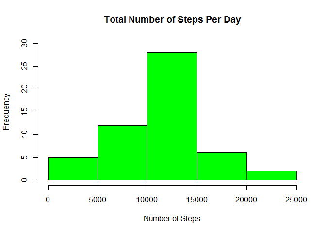
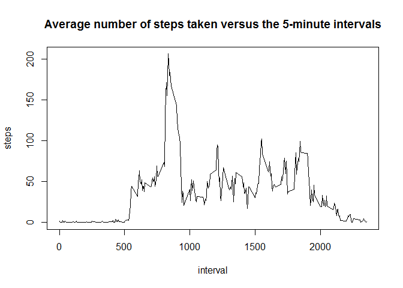
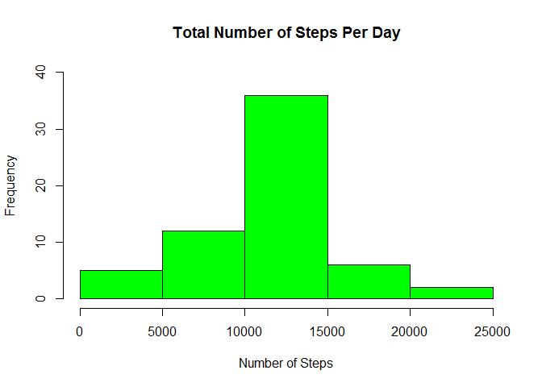
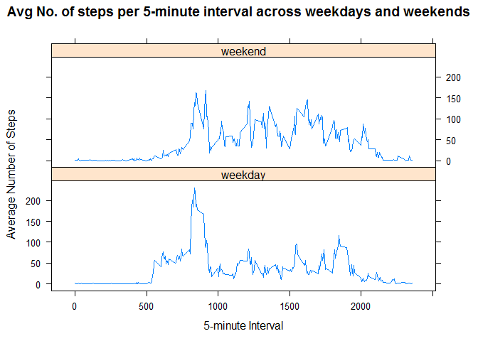

# Reproducible Research: Peer Assessment 1
Done by: Amal  
Publish Date: 5-Mar-2015  

###Set Global Options
Make sure all code will be available in the generated report

```r
library("knitr")
opts_chunk$set(echo=TRUE)
```

## Loading and preprocessing the data
Make sure your data is available in same directory where the Rmd file is available

```r
#Read Data
unzip(zipfile="activity.zip")
act <- read.csv("activity.csv")
#Convert date column to Date
act$date <- as.Date(act$date,format="%Y-%m-%d")
```

## What is mean total number of steps taken per day?
* Note: This section ignores missing values  
A histogram of the total number of steps taken each day:  

```r
noNA <- act[!is.na(act$steps),]
steps_day <- aggregate(noNA$steps, by=list(date=noNA$date), FUN=sum,na.rm=TRUE)
colnames(steps_day) <- c("date","totalSteps")
hist(steps_day$totalSteps,xlab="Number of Steps",main="Total Number of Steps Per Day",col="green",ylim=range(0,30))
```

 

The mean and median of the total number of steps taken per day: 

```r
stepsMean1 <- mean(steps_day$totalSteps,na.rm=TRUE)
stepsMean1
```

```
## [1] 10766.19
```

```r
stepsMedian1 <- median(steps_day$totalSteps,na.rm=TRUE)
stepsMedian1
```

```
## [1] 10765
```

## What is the average daily activity pattern?
* Note: This section ignores missing values  
A time series plot of the 5-minute interval and the average number of steps taken, averaged across all days:  

```r
#use filtered data set with no NAs
steps_interval <- aggregate(noNA$steps, by=list(interval=noNA$interval), FUN=mean,na.rm=TRUE)
colnames(steps_interval) <- c("interval","steps")
with(steps_interval,plot(interval,steps,type="l"),xlab="5-minute Interval",ylab="Number of Steps")
title("Average number of steps taken versus the 5-minute intervals")
```

 

The 5-minute interval which contains the maximum number of steps:

```r
steps_interval$interval[steps_interval$steps==max(steps_interval$steps)]
```

```
## [1] 835
```


## Imputing missing values
This section is about missing values. All NA values will be filled with the mean value for the 5-minute interval calculated above. Below are the detailed steps:  
1.  Get The total number of missing values in the dataset 

```r
mvcount <- sum(is.na(act$steps))
mvcount
```

```
## [1] 2304
```

2. Create new data set with NA values filled by the mean for that 5-minute interval

```r
act_nomv <- act
for (i in 1:nrow(act_nomv))
    if(is.na(act_nomv$steps[i]))
        act_nomv$steps[i]<- steps_interval$steps[act_nomv$interval[i]==steps_interval$interval]
```

3. Plot a histogram of the total number of steps taken each day after filling NA values:

```r
steps_day <- aggregate(act_nomv$steps, by=list(date=act_nomv$date), FUN=sum)
colnames(steps_day) <- c("date","totalSteps")
hist(steps_day$totalSteps,xlab="Number of Steps",main="Total Number of Steps Per Day",col="green",ylim=range(0,40))  
```

 

4. Calculate mean and median total number of steps taken per day after filling NA values


```r
stepsMean2 <- mean(steps_day$totalSteps)
stepsMean2
```

```
## [1] 10766.19
```

```r
stepsMedian2 <- median(steps_day$totalSteps)
stepsMedian2
```

```
## [1] 10766.19
```

Mean and median changes after filling NA values as follows:  

* Mean changes from 1.0766189\times 10^{4} to 1.0766189\times 10^{4}
* Median changes from 10765 to 1.0766189\times 10^{4}


## Are there differences in activity patterns between weekdays and weekends?


```r
for (i in 1:nrow(act_nomv)){
    if(weekdays(act_nomv$date[i]) %in% c("Saturday", "Sunday"))
        act_nomv$daytype[i] <- "weekend"
    else
        act_nomv$daytype[i] <- "weekday"
}

act_nomv$daytype <- as.factor(act_nomv$daytype)
steps_interval <- aggregate(act_nomv$steps, by=list(daytype=act_nomv$daytype,interval=act_nomv$interval), FUN=mean) 
colnames(steps_interval) <- c("daytype","interval","steps")
library(lattice)
xyplot(steps~interval | daytype, data = steps_interval, layout = c(1, 2),type="l",main="Avg No. of steps per 5-minute interval across weekdays and weekends",xlab="5-minute Interval",ylab="Average Number of Steps")
```

 

